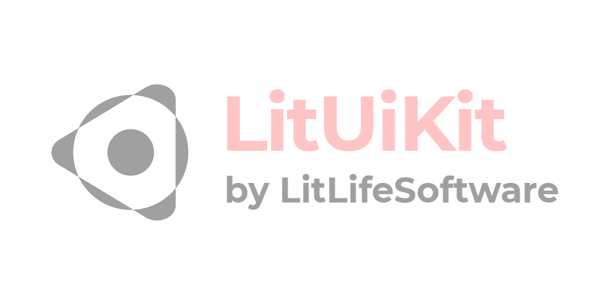
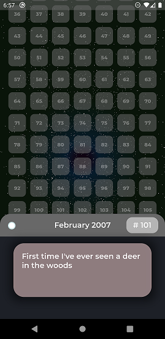

# 

LitUIKit enables you to create unique user interfaces in less time. Built with Flutter this UI Kit complements the default Material Widgets shipped with
the framework. Whose Widgets include custom implementation of Snackbars,
AppBars and Utility Screens (e.g. to verify the user's age and to show the
application's licenses).

Visit our [website](https://litlifesoftware.github.io) for more details.

Created and maintained by [LitLifeSoftware](https://www.instagram.com/litlifesw/) (Michael Grigorenko).

## Getting Started

To use the LitUIKit in your Flutter app make sure to import it by including the
code line `import 'package:lit_ui_kit/lit_ui_kit.dart';` in the header part of
your `.dart` file.

For help getting started with Flutter, view Flutter's
[online documentation](https://flutter.dev/docs), which offers tutorials,
samples, guidance on mobile development, and a full API reference.

## Documentation

View our [documentation](doc/api/index.html) for LitUIKit including all classes for further details.

## Apps built with LitUIKit

- [Remaining Lifetime](https://litlifesoftware.github.io/) by LitLifeSoftware - [Google Play](https://play.google.com/store/apps/details?id=com.litlifesoftware.remaining_lifetime)

> Visualize your entire life. Memorize your achievements and make every month count.

> 

- [History Of Me](https://litlifesoftware.github.io/) by LitLifeSoftware - in production

> Your own personal digital diary.

## Example app

To get a better understanding for implementing LitUIKit's widgets we recommend
to take a look at the example app provided in the `example` folder. Feel free to
experiment with the UI.

## Dependencies

LitUIKit uses the following Dart dependencies in order to implement certain
features and functionality:

- [package_info](https://pub.dev/packages/package_info) - [License](https://github.com/flutter/plugins/blob/master/LICENSE) (Used to detect the platform)
- [url_launcher](https://pub.dev/packages/url_launcher) - [License](https://github.com/flutter/plugins/blob/master/packages/url_launcher/url_launcher/LICENSE) (Used to
  redirect users to websites)
- [dartdoc](https://pub.dev/packages/url_launcher) - [License](https://github.com/dart-lang/dartdoc/blob/master/LICENSE) (Used to create the documentation)

## Credits

LitUIKit is made possible thanks to the Flutter Project. It uses the serif font
[Merriweather](https://fonts.google.com/specimen/Merriweather?query=merri&preview.text=LitLifeSoftware%20was%20here...&preview.text_type=custom) (designed by Sorkin Type), the sans serif font [Montserrat](https://fonts.google.com/specimen/Montserrat?query=montserrat&preview.text=LitLifeSoftware%20was%20here...&preview.text_type=custom) (designed by Julieta Ulanovsky, Sol Matas, Juan Pablo del Peral, Jacques Le Bailly) and the monospace font [VT323](https://fonts.google.com/specimen/VT323?query=VT323&preview.text=LitLifeSoftware%20was%20here...&preview.text_type=custom) (designed by Peter Hull).

## License

All the fonts in the `src/fonts` folder are licensed under the **Open Font License**.

All the icons in the `src/fonts/Icons` folder are distributed under the **CC-BY** license.

Everything else in this repository including the source code is distributed under the
**BSD 3-Clause** license as specified in the `LICENSE` file.
