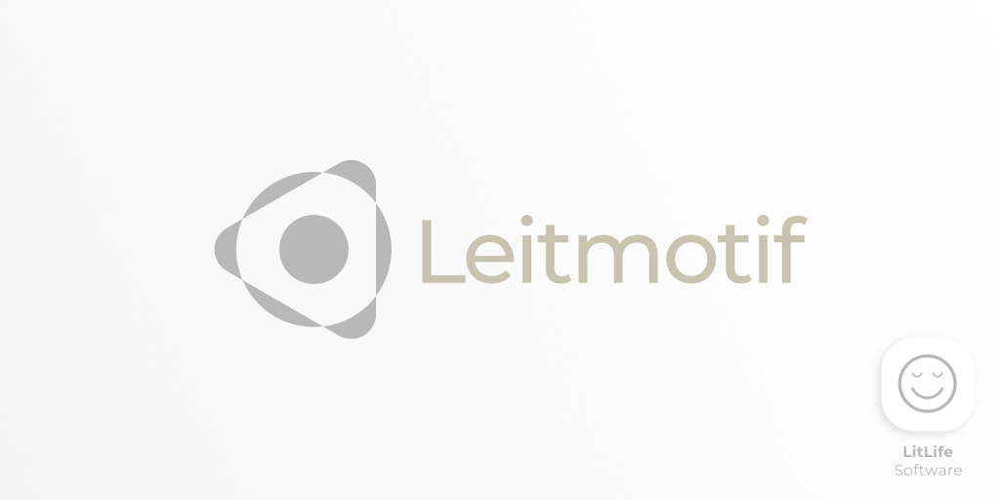

> [![leitmotif][leitmotif_badge_pub]][leitmotif] [![pub points][leitmotif_badge_pub_points]][leitmotif_pub_points]

## What is Leitmotif?

A collection of widgets and screens for Flutter implementing the Leitmotif Design Language. It complements the default Material Widgets shipped with Flutter. Whose Widgets include custom implementation of `Snackbars`, `AppBars` and a settings panel. Utility Screens (e.g. required to verify the user's age and to show the application's licenses) are also included.

> 'Leitmotif' is derived from the German noun 'Leitmotiv' which describes a dominant and recurring theme in music and literature.

Leitmotif is based on the [LitUIKit](https://github.com/litlifesoftware/lit_ui_kit) project, which has been discontinued.

Visit our [website](https://litlifesoftware.github.io) for more details.

Created and maintained by [LitLifeSoftware](https://www.github.com/litlifesoftware/).

## Getting Started

To use Leitmotif in your Flutter app make sure to import it by including the code line `import 'package:leitmotif/leitmotif.dart';` in the header part of your `.dart` file.

For help getting started with Flutter, view Flutter's
[online documentation](https://flutter.dev/docs), which offers tutorials,
samples, guidance on mobile development, and a full API reference.

## Screenshots

| Example App        | Snackbar           |
| ------------------ | ------------------ |
| ![1][screenshot_1] | ![2][screenshot_2] |

| Date Picker        | Licence Screen     |
| ------------------ | ------------------ |
| ![3][screenshot_3] | ![4][screenshot_4] |

## Localizations

Leitmotif's widgets are currently localized in `English` and `German`.
To use Leitmotif's default localizations in your Flutter app make sure to utilize the `LeitmotifLocalizationsDelegate` on your`MaterialApp`.
Some widgets also require the `GlobalMaterialLocalizations.delegate`, `GlobalWidgetsLocalizations.delegate` and `GlobalCupertinoLocalizations.delegate`.

```dart
    return MaterialApp(
      title: 'Leitmotif',
      localizationsDelegates: const [
        LeitmotifLocalizationsDelegate(),
        GlobalMaterialLocalizations.delegate,
        GlobalWidgetsLocalizations.delegate,
        GlobalCupertinoLocalizations.delegate,
      ],
      supportedLocales: const [
        Locale('en', ''),
        Locale('de', ''),
      ],
      home: ExampleHomeScreen(),
    );
```

## Icons

Leitmotif does utilize its own icons (`LitIcons`). They are stored inside a `ttf` file and are implemented as Dart `IconData` objects.

## Example app

To get a better understanding for implementing Leitmotif's widgets we recommend
to take a look at the example app provided in the `example` folder. Feel free to
experiment with the UI.

## Previous Releases

Due to `leitmotif` being derived from the `lit_ui_kit` project, releases prior to `v.1.4.0` are only available on `lit_ui_kit`. Get a list of all releases of `lit_ui_kit` on [pub.dev](https://pub.dev/packages/lit_ui_kit) or on [its repository](https://github.com/litlifesoftware/lit_ui_kit).

## Dependencies

Leitmotif uses the following Dart dependencies in order to implement certain
features and functionality:

- [package_info](https://pub.dev/packages/package_info) - [License](https://github.com/flutter/plugins/blob/master/LICENSE) (Used to detect the platform and version details)
- [intl](https://pub.dev/packages/intl) - [License](https://pub.dev/packages/intl/license) (Used to access the device's locale)
- [flutter_localizations](https://pub.dev/packages/flutter_localizations) - [License](https://github.com/flutter/plugins/blob/master/LICENSE) (Used to implement default localizations)
- [dartdoc](https://pub.dev/packages/dartdoc) - [License](https://pub.dev/packages/dartdoc/license) (Used to create the documentation)

## Credits

Leitmotif is made possible thanks to the Flutter Project. It utilizes the serif font
[Merriweather](https://fonts.google.com/specimen/Merriweather?query=merri&preview.text=LitLifeSoftware%20was%20here...&preview.text_type=custom), the sans serif font [Montserrat](https://fonts.google.com/specimen/Montserrat?query=montserrat&preview.text=LitLifeSoftware%20was%20here...&preview.text_type=custom) and the monospace font [CourierPrime](https://github.com/quoteunquoteapps/CourierPrime).

## License

All the fonts in the `assets/fonts` folder are licensed under the **SIL OPEN FONT LICENSE**.

All the icons in the `assets/icons` folder are distributed under the **CC-BY** license.

All the images and screenshots in the `assets/images` folder are distributed under the **CC-BY** license.

Everything else in this repository including the source code is distributed under the
**BSD 3-Clause** license as specified in the `LICENSE` file.

[screenshot_1]: assets/images/Screenshot_1.png
[screenshot_2]: assets/images/Screenshot_2.png
[screenshot_3]: assets/images/Screenshot_3.png
[screenshot_4]: assets/images/Screenshot_4.png
[leitmotif]: https://pub.dev/packages/leitmotif
[leitmotif_pub_points]: https://pub.dev/packages/leitmotif/score
[leitmotif_badge_pub]: https://img.shields.io/pub/v/leitmotif.svg
[leitmotif_badge_pub_points]: https://badges.bar/leitmotif/pub%20points
