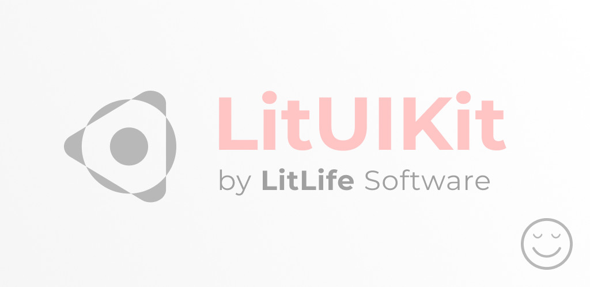
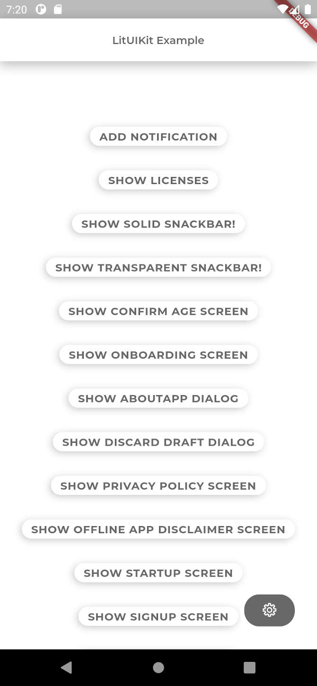
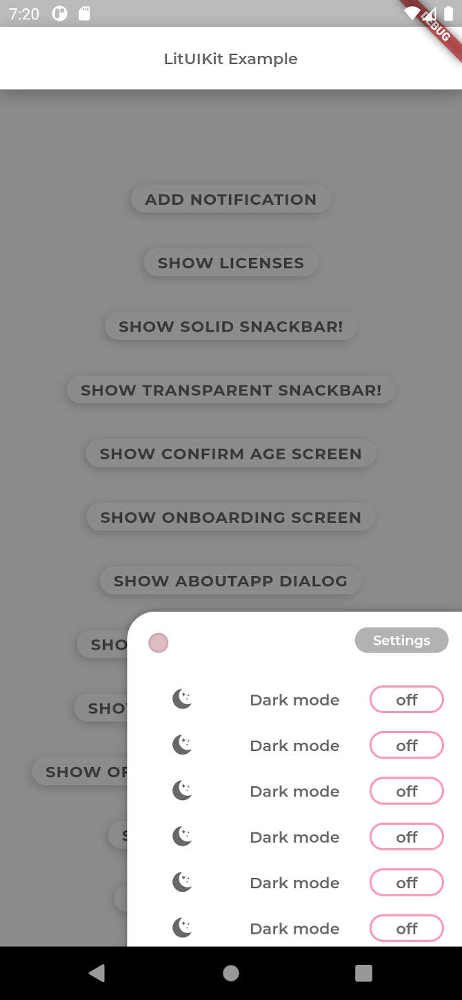
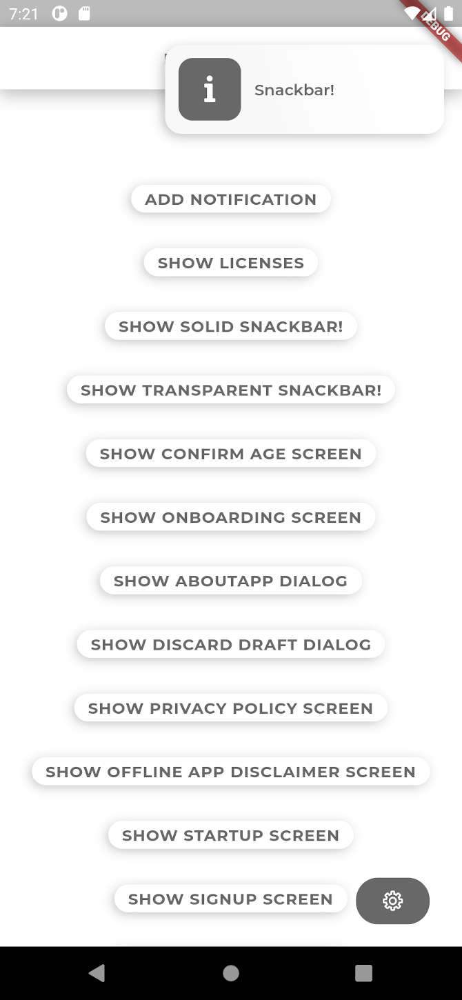
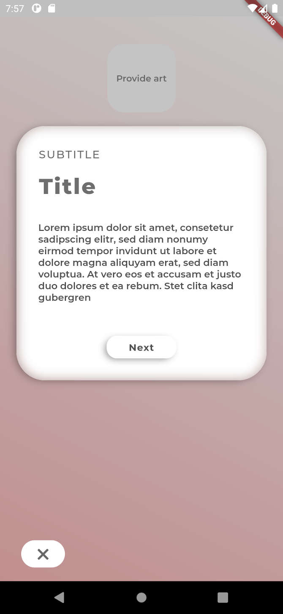

# 

LitUIKit is a collection of Flutter widgets to create unique user interfaces. It complements the default Material Widgets shipped with Flutter. Whose Widgets include custom implementation of Snackbars,
AppBars and a settings panel. Utility Screens (e.g. required to verify the user's age and to show the
application's licenses) are also included.

Visit our [website](https://litlifesoftware.github.io) for more details.

Created and maintained by [LitLifeSoftware](https://www.github.com/litlifesoftware/).

## Getting Started

To use the LitUIKit in your Flutter app make sure to import it by including the
code line `import 'package:lit_ui_kit/lit_ui_kit.dart';` in the header part of
your `.dart` file.

For help getting started with Flutter, view Flutter's
[online documentation](https://flutter.dev/docs), which offers tutorials,
samples, guidance on mobile development, and a full API reference.

## Screenshots

| Example HomeScreen                                                    | LitSettingsPanel                                                      |
| --------------------------------------------------------------------- | --------------------------------------------------------------------- |
|  |  |

| LitIconSnackbar                                                       | LitOnboardingScreen                                                   |
| --------------------------------------------------------------------- | --------------------------------------------------------------------- |
|  |  |

## Icons

LitUIKit does utilize its own icons (`LitIcons`). They are stored inside a `ttf` file and are implemented as Dart `IconData` objects.

## Example app

To get a better understanding for implementing LitUIKit's widgets we recommend
to take a look at the example app provided in the `example` folder. Feel free to
experiment with the UI.

## Dependencies

LitUIKit uses the following Dart dependencies in order to implement certain
features and functionality:

- [package_info](https://pub.dev/packages/package_info) - [License](https://github.com/flutter/plugins/blob/master/LICENSE) (Used to detect the platform and version details)
- [intl](https://pub.dev/packages/intl) - [License](https://pub.dev/packages/intl/license) (Used to implement localizations)
- [dartdoc](https://pub.dev/packages/dartdoc) - [License](https://pub.dev/packages/dartdoc/license) (Used to create the documentation)

## Credits

LitUIKit is made possible thanks to the Flutter Project. It utilizes the serif font
[Merriweather](https://fonts.google.com/specimen/Merriweather?query=merri&preview.text=LitLifeSoftware%20was%20here...&preview.text_type=custom) (designed by Sorkin Type), the sans serif font [Montserrat](https://fonts.google.com/specimen/Montserrat?query=montserrat&preview.text=LitLifeSoftware%20was%20here...&preview.text_type=custom) (designed by Julieta Ulanovsky, Sol Matas, Juan Pablo del Peral, Jacques Le Bailly) and the monospace font [VT323](https://fonts.google.com/specimen/VT323?query=VT323&preview.text=LitLifeSoftware%20was%20here...&preview.text_type=custom) (designed by Peter Hull).

## License

All the fonts in the `src/fonts` folder are licensed under the **Open Font License**.

All the icons in the `src/fonts/Icons` folder are distributed under the **CC-BY** license.

Everything else in this repository including the source code is distributed under the
**BSD 3-Clause** license as specified in the `LICENSE` file.
